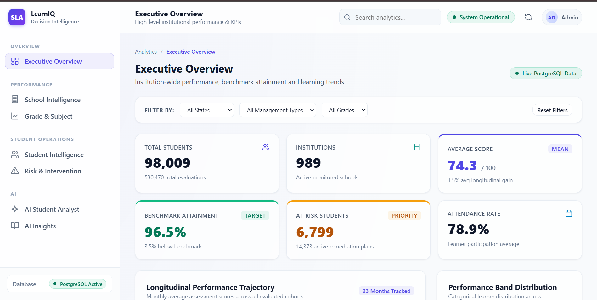
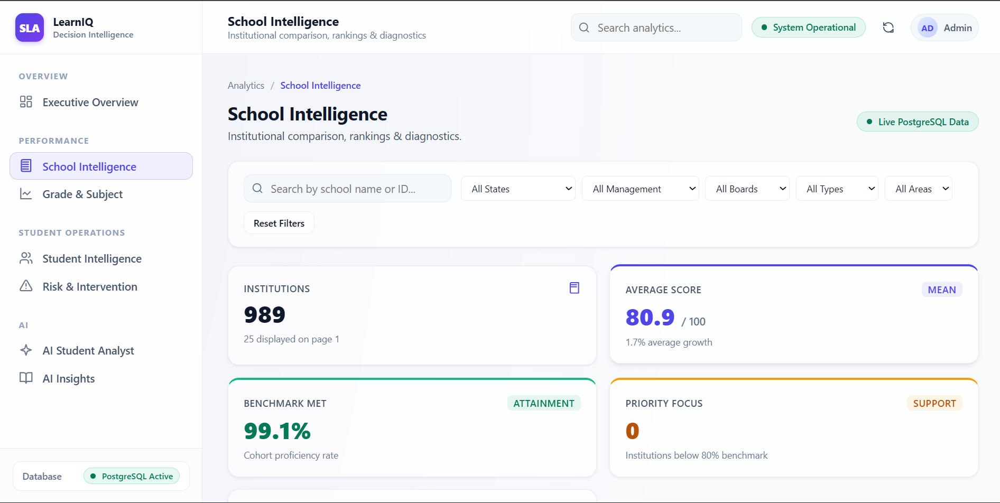
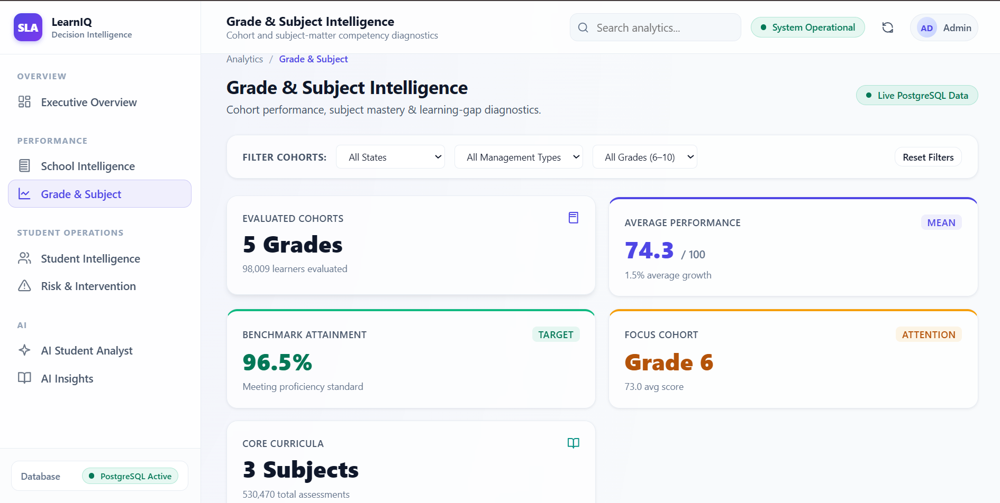
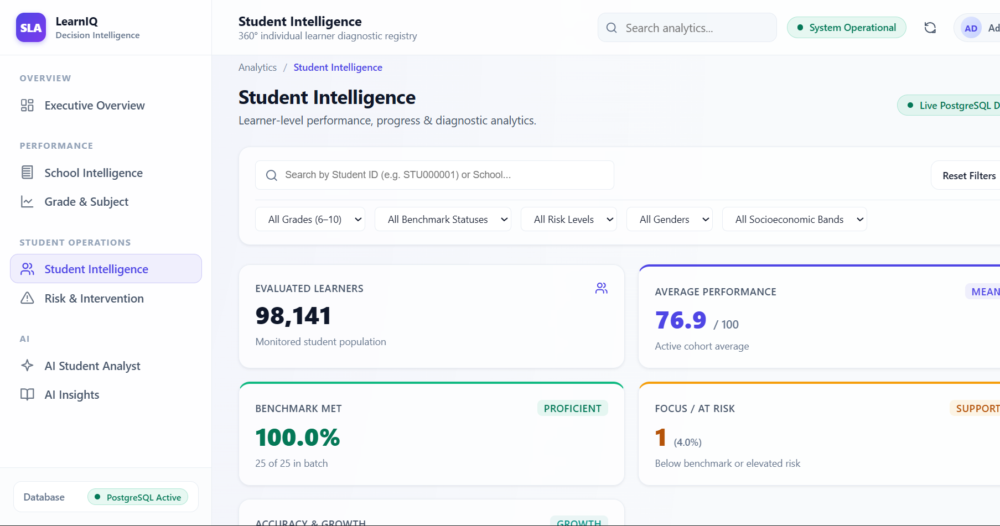
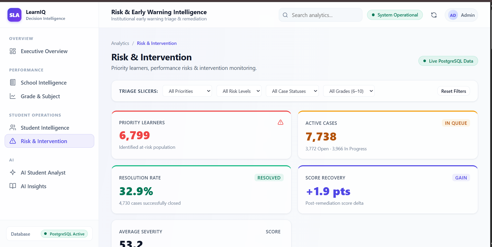
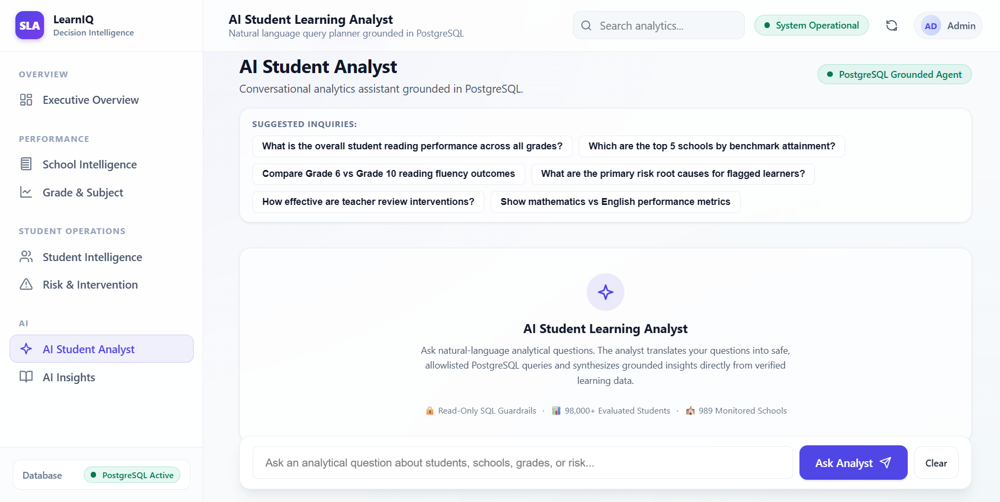
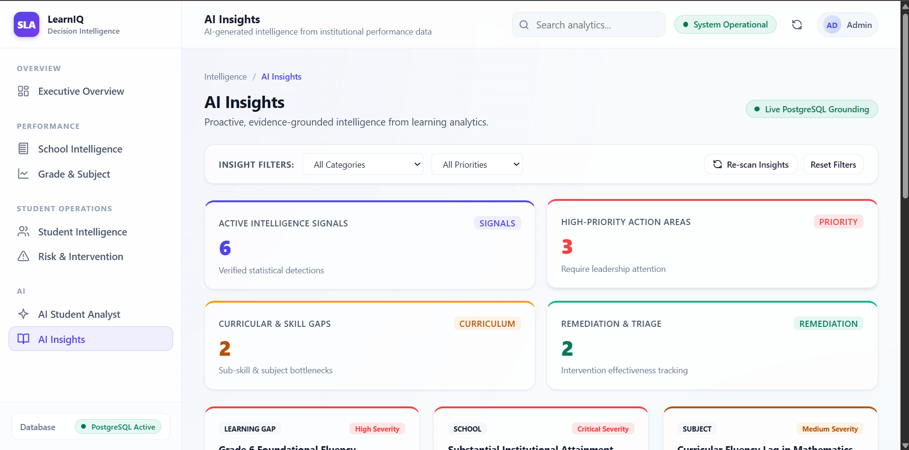

# Student Learning Analytics & Decision Intelligence Platform

A full-stack analytics platform for turning student, school, assessment, engagement, and intervention data into **executive intelligence, learner diagnostics, risk signals, interventions, and grounded AI assistance**.

> **Portfolio note:** The screenshots in `ss/` document the completed working interface and are included as visual evidence for portfolio/interview purposes. The project is **not presented as a deployed application**. Local PostgreSQL credentials and environment secrets are intentionally excluded from GitHub.

## What this project demonstrates

- Full-stack analytics application with a vanilla HTML/CSS/JavaScript frontend and FastAPI backend
- PostgreSQL analytics layer with staging, analytics, ETL, validation, indexes, views, and decision-intelligence SQL
- ETL workflow for extraction, transformation, validation, quality logging, rejection handling, and analytics loading
- Executive, school, grade, subject, student, risk, intervention, and insight analytics
- Student 360-degree and school diagnostic views
- Early-warning/risk intelligence and intervention recommendations
- Grounded AI Student Analyst backed by application data rather than free-form unsupported answers
- Proactive AI insights workflow
- SQL guardrails and read-only database query execution for analytical APIs
- Automated validation and test scripts

## Product overview

The platform is organized around a decision flow:

**Raw/operational data → ETL & data quality → PostgreSQL analytics layer → REST APIs → intelligence UI → AI-assisted decisions**

### Core modules

| Module | Purpose |
|---|---|
| Executive Overview | System-level KPIs, trends, performance bands, rankings, and decision signals |
| School Intelligence | School scorecards, comparisons, diagnostics, and institutional performance |
| Grade Intelligence | Grade/cohort outcomes, subject performance, gaps, and learning diagnostics |
| Student Intelligence | Student directory and 360-degree learning profiles |
| Risk & Interventions | Early-warning indicators, risk distribution, and intervention priorities |
| AI Student Analyst | Natural-language analytical questions grounded in platform data |
| AI Insights | Proactive, data-grounded insight detection and recommended actions |

## Architecture

The repository includes four architecture diagrams in `Diagrams/`:

1. **System Architecture Diagram** — application and infrastructure components
2. **ER Diagram / Database Schema** — analytical data model and relationships
3. **Data Flow Diagram** — movement from source data through ETL and analytics to the UI
4. **Application Module Architecture** — backend/frontend module boundaries

## Technology stack

**Frontend:** HTML5, CSS3, JavaScript (ES modules), responsive dashboard UI

**Backend:** Python, FastAPI, Pydantic, PostgreSQL connection pooling

**Data & Analytics:** PostgreSQL, SQL views, indexes, ETL validation, data-quality logging

**AI:** Google Gemini through the backend AI service, with fallback handling and grounded application context

**Testing & Validation:** pytest, Python validation scripts, frontend syntax/integration checks

## Repository structure

```text
Student-Learning-Analytics-Decision-Intelligence/
├── backend/                 # FastAPI API and analytics services
├── frontend/                # Dashboard UI and page modules
├── etl/                     # Extract → transform → validate → load pipeline
├── sql/                     # Database schema, analytics views and decision rules
├── docs/                    # Architecture and engineering documentation
├── Diagrams/                # System, ER, data-flow and module diagrams
├── ss/                      # Categorized screenshots / portfolio evidence
├── scripts/                 # Selected health and validation utilities
├── tests/                   # Selected tests for current source modules
├── .env.example             # Safe configuration template
├── .gitignore               # Git exclusions for secrets/caches/local data
├── requirements.txt         # Python dependencies
└── README.md
```

## Screenshot evidence

Only the most useful screenshots are embedded here. **All screenshots are preserved and categorized under `ss/`** so they can be shown during an interview if the local application/database is not running.

### Executive Overview



### School Intelligence



### Grade Intelligence



### Student Intelligence



### Risk & Interventions



### AI Student Analyst



### AI Insights



### Complete screenshot archive

- `ss/Executive_Overview/` — executive dashboard states
- `ss/School_Intelligence/` — school directory and diagnostics
- `ss/Grade_Intelligence/` — grade analytics and detailed diagnostics
- `ss/Student_Intelligence/` — student directory and profile views
- `ss/Risk_and_Interventions/` — risk and intervention views
- `ss/AI_Analyst/` — AI Student Analyst interface
- `ss/AI_Insights/` — proactive AI insight views

## Database and data policy

The repository contains the **database build and analytics SQL**, but not the local source dataset or private database credentials.

This keeps the GitHub repository focused on the engineering work while avoiding unnecessary large/raw files and secrets. The database foundation can be reconstructed from the SQL scripts in `sql/` when the source data is available.

### SQL sequence

The numbered SQL files are intended to be executed in dependency order, followed by the validation scripts:

```text
01_create_schemas.sql
02_create_staging_tables.sql
03_create_analytics_tables.sql
04_create_etl_tables.sql
05_create_indexes.sql
06_analytics_views.sql
07_decision_intelligence.sql
08_validate_analytics.sql
09_create_powerbi_master.sql
09_validate_powerbi_master.sql
10_validate_decision_intelligence.sql
verify.sql
```

## Local setup

### 1. Clone the repository

```bash
git clone <your-github-repository-url>
cd Student-Learning-Analytics-Decision-Intelligence
```

### 2. Create a virtual environment

Windows PowerShell:

```powershell
python -m venv .venv
.\.venv\Scripts\Activate.ps1
pip install -r requirements.txt
```

macOS/Linux:

```bash
python3 -m venv .venv
source .venv/bin/activate
pip install -r requirements.txt
```

### 3. Configure environment variables

Copy `.env.example` to `.env` and add your **local** PostgreSQL and Gemini configuration.

```text
POSTGRES_HOST=localhost
POSTGRES_PORT=5432
POSTGRES_DB=student_learning_analytics
POSTGRES_USER=postgres
POSTGRES_PASSWORD=your_local_password
GEMINI_API_KEY=your_local_key
```

Never commit `.env` or real API keys.

### 4. Start the backend

From the repository root:

```bash
uvicorn backend.main:app --reload --port 8000
```

FastAPI documentation will be available locally at `/docs`.

### 5. Start the frontend

The frontend is a static ES-module application and expects the backend at:

```text
http://127.0.0.1:8000
```

Serve `frontend/` with a local static server rather than opening the HTML file directly. For example, with Python:

```bash
cd frontend
python -m http.server 5500
```

Then open the local frontend URL shown by the server.

## Security and engineering practices

- Environment variables are used for database and AI credentials.
- `.env` is excluded from version control.
- Backend database access uses a PostgreSQL connection pool.
- Analytical database access is designed around read-only query execution.
- SQL guardrails validate analytical queries before execution.
- Statement timeouts reduce the impact of unexpectedly expensive queries.
- API filtering and pagination are implemented for large analytical directories.
- AI responses are generated through backend services and grounded in application data.
- Validation/test utilities are included to support database, ETL, API, and frontend checks.

## Documentation

The `docs/` directory contains deeper technical documentation covering:

- analytics layer
- analytics requirements
- database architecture
- data refresh workflow
- decision-intelligence architecture
- decision rules
- ETL pipeline
- Power BI master view

## Interview explanation

A concise way to describe the project:

> **“I built a full-stack student learning analytics and decision-intelligence platform. PostgreSQL acts as the analytics layer, an ETL pipeline validates and loads the data, FastAPI exposes analytical APIs, and a JavaScript dashboard turns those APIs into executive, school, grade, student, risk, intervention, and AI-assisted decision views. I also added SQL guardrails, validation, caching, and grounded AI workflows so the system is designed as an analytics product rather than just a dashboard.”**

## Important repository decision

This GitHub version intentionally contains the **clean, active project source** rather than every local development artifact. It excludes:

- `.env` and secrets
- Python bytecode and caches
- frontend backup copies
- old/reference backend implementations
- local raw datasets/database dumps
- generated runtime reports/logs
- duplicate screenshot copies

The result is a cleaner portfolio repository that an interviewer can inspect without having to navigate through development leftovers.
